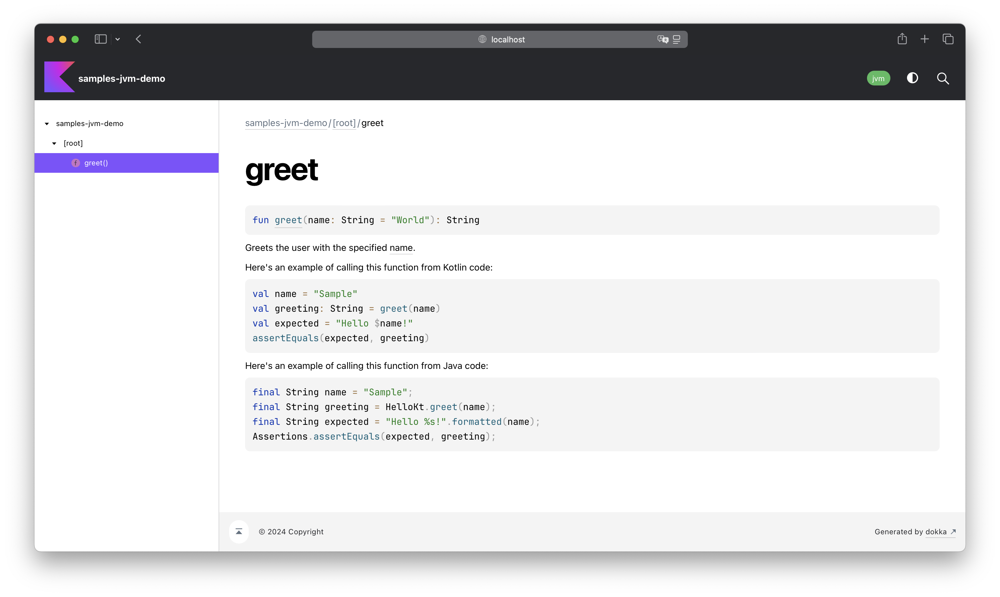

# Kotools Samples

[![Latest][kotools-samples-badge]][kotools-samples-releases]
[![Gradle][gradle-badge]][gradle]
[![Kotlin][kotlin-badge]][kotlin]
[![Dokka][dokka-badge]][dokka]

**Kotools Samples** is a [Gradle] plugin designed to help [Kotlin] library
authors integrate **read-only, non-editable samples** into their documentation
using [Dokka]. It addresses a limitation in [Dokka], which does not allow making
code samples **non-editable** or **non-executable**.

## ⭐️ Key Features

- **Readonly inlined code samples:** Displays your examples inlined in the
  documentation, ensuring they are non-editable and non-executable, preventing
  unwanted modification or execution.
- **[Kotlin] or Java support:** Write your code samples in either [Kotlin] or
  Java, providing flexibility to serve a broader range of developers.
- **Sample visibility in IDE:** Unlike many libraries (such as Jetpack Compose),
  Kotools Samples makes your examples visible within the IDE (e.g.,
  IntelliJ IDEA, Android Studio), enhancing accessibility and usability during
  development.
- **Always correct samples:** Ensures your examples are always up-to-date by
  compiling them alongside your main and test sources. Any breaking changes in
  your codebase will trigger compilation errors, prompting you to update the
  examples.
- **Kotlin/JVM support:** Fully supports the Kotlin/JVM platform, with [Kotlin]
  Multiplatform support in future releases.
- **Seamless integration:** Works effortlessly with [Kotlin], Java, and [Dokka],
  smoothly integrating into your Gradle build process.

## 🛠️ Installation

For adding Kotools Samples to your Kotlin/JVM project, it is recommended to use
the [Gradle] plugins DSL in [Kotlin]. Just replace the `$version` variable by
the [latest version](#kotools-samples) or by another one available in the
[changelog](CHANGELOG.md).

```kotlin
plugins {
  id("org.kotools.samples.jvm") version "$version"
}
```

See [this plugin on the Gradle Plugin Portal][kotools-samples-plugin] for more
installation options.

## 🧑‍💻 Usage example

Kotools Samples ensures that your code samples are integrated into your
documentation without affecting your main sources. When generating the
documentation with [Dokka], the plugin temporarily modifies the main sources to
inline the samples, and restores them afterward to avoid polluting the main
codebase. This process is transparent and automatic.

Here's a [Kotlin] sample:

```kotlin
// src/sample/kotlin/HelloKotlinSample.kt

import kotlin.test.Test
import kotlin.test.assertEquals

class HelloKotlinSample {
    @Test
    fun greet() {
        val name = "Sample"
        val greeting: String = greet(name)
        val expected = "Hello $name!"
        assertEquals(expected, greeting)
    }
}
```

And a Java sample:

```java
// src/sample/java/HelloJavaSample.java

import org.junit.jupiter.api.Assertions;
import org.junit.jupiter.api.Test;

class HelloJavaSample {
    @Test
    void greet() {
        final String name = "Sample";
        final String greeting = HelloKt.greet(name);
        final String expected = "Hello %s!".formatted(name);
        Assertions.assertEquals(expected, greeting);
    }
}
```

Reference these samples in your [Dokka] documentation:

```kotlin
// src/main/kotlin/Hello.kt

/**
 * Greets the user with the specified [name].
 *
 * Here's an example of calling this function from Kotlin code:
 *
 * SAMPLE: [HelloKotlinSample.greet]
 *
 * Here's an example of calling this function from Java code:
 *
 * SAMPLE: [HelloJavaSample.greet]
 */
fun greet(name: String = "World"): String = "Hello $name!"
```

Here's the resulting documentation generated by [Dokka] with Kotools Samples:



## 📝 Documentation

Here's additional documentation for learning more about this project:

- [Dependency compatibility](documentation/dependencies.md)
- [Security Policy](SECURITY.md)

## 🤝 Community

Join our thriving community! Connect, share insights, and collaborate with
fellow developers to make Kotools Samples even more powerful.

- [#kotools on Kotlin Slack](https://kotlinlang.slack.com/archives/C05H0L1LD25)

## 📣 Show Your Support

If you find this project valuable, show your support by giving us a ⭐️ on
GitHub. Your feedback and engagement mean the world to us!

## 🚧 Contributing

Contributions are welcome! Feel free to submit bug reports, feature requests, or
pull requests to improve the plugin.

## 🙏 Acknowledgements

Thanks to [Loïc Lamarque][@LVMVRQUXL] for creating and sharing this project with
the open source community.

Thanks to all the [people that ever contributed][kotools-samples-contributors]
through code or other means such as bug reports, feature suggestions and so on.

## 📄 License

This project is licensed under the [MIT License](LICENSE.txt).

<!------------------------------ External links ------------------------------->

[@LVMVRQUXL]: https://github.com/LVMVRQUXL
[dokka]: https://kotl.in/dokka
[dokka-badge]: https://img.shields.io/badge/Dokka-v1.8.20-blue
[gradle]: https://gradle.org
[gradle-badge]: https://img.shields.io/badge/Gradle-v8.10.2-blue
[kotlin]: https://kotlinlang.org
[kotlin-badge]: https://img.shields.io/badge/Kotlin-v1.8.22-blue?logo=kotlin
[kotools-samples-badge]: https://img.shields.io/gradle-plugin-portal/v/org.kotools.samples.jvm?label=Latest
[kotools-samples-contributors]: https://github.com/kotools/samples/graphs/contributors
[kotools-samples-plugin]: https://plugins.gradle.org/plugin/org.kotools.samples.jvm
[kotools-samples-releases]: https://github.com/kotools/samples/releases
