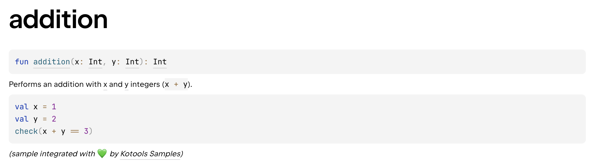

# Kotools Samples

[![Latest][kotools-samples-badge]][kotools-samples-releases]
[![Gradle][gradle-badge]][gradle]
[![Kotlin][kotlin-badge]][kotlin]
[![Dokka][dokka-badge]][dokka]

**Kotools Samples** is a [Gradle] plugin designed to help [Kotlin] library
authors integrate **read-only samples** into their documentation. It addresses a
limitation in [Dokka], which does not allow making code samples **non-editable**
or **non-executable**.

## ⭐️ Key Features

- **Readonly inlined code samples:** Displays your examples inlined in the
  documentation, ensuring they are non-editable and non-executable, preventing
  unwanted modification or execution.
- **Sample visibility in IDE:** Unlike many libraries (such as Jetpack Compose),
  Kotools Samples makes your examples visible within the IDE (e.g.,
  IntelliJ IDEA, Android Studio), enhancing accessibility and usability during
  development.
- **Always correct samples:** Ensures your examples are always up-to-date by
  compiling them alongside your main and test sources. Any breaking changes in
  your codebase will trigger compilation errors, prompting you to update the
  examples.
- **Kotlin/JVM support:** Fully supports the Kotlin/JVM platform, with [Kotlin]
  Multiplatform support in future releases.
- **Seamless integration:** Works effortlessly with [Kotlin] and [Dokka],
  smoothly integrating into your Gradle build process.

## 🛠️ Installation

For adding Kotools Samples to your Kotlin/JVM project, it is recommended to use
the [Gradle] plugins DSL in [Kotlin]. Just replace the `$version` variable by
the [latest version](#kotools-samples) or by another one available in the
[changelog](CHANGELOG.md).

```kotlin
// Plugin dependency:
plugins { id("org.kotools.samples") version "$version" }

// Library dependency:
dependency { implementation("org.kotools:samples-gradle-plugin:$version") }
```

> The `org.kotools.samples.jvm` plugin is deprecated (see
> [#42](https://github.com/kotools/samples/issues/42)).

See [this plugin on the Gradle Plugin Portal][kotools-samples-plugin] for more
installation options.

## 🧑‍💻 Usage example

Kotools Samples ensures that your code samples are integrated into your
documentation without affecting your main sources. For doing so, it creates a
source set named `sample` dedicated for code samples.

Here's a [Kotlin] sample:

```kotlin
// File location: src/sample/kotlin/IntSample.kt

import kotlin.test.Test

class IntSample {
    @Test
    fun addition() {
        val x = 1
        val y = 2
        check(x + y == 3)
    }
}
```

Reference this sample in your [Dokka] documentation:

```kotlin
// File location: src/main/kotlin/Int.kt

/**
 * Performs an addition with [x] and [y] integers (`x + y`).
 *
 * SAMPLE: [IntSample.addition]
 */
public fun addition(x: Int, y: Int): Int = x + y
```

Here's this function's documentation generated by [Dokka] with Kotools Samples:



## 📝 Documentation

Here's additional documentation for learning more about this project:

- [Dependency compatibility](documentation/dependencies.md)
- [Security Policy](SECURITY.md)

## 🤝 Community

Join our thriving community! Connect, share insights, and collaborate with
fellow developers to make Kotools Samples even more powerful.

- [#kotools on Kotlin Slack](https://kotlinlang.slack.com/archives/C05H0L1LD25)

## 📣 Show Your Support

If you find this project valuable, show your support by giving us a ⭐️ on
GitHub. Your feedback and engagement mean the world to us!

## 🚧 Contributing

Contributions are welcome! Feel free to submit bug reports, feature requests, or
pull requests to improve the plugin.

## 🙏 Acknowledgements

Thanks to [Loïc Lamarque][@LVMVRQUXL] for creating and sharing this project with
the open source community.

Thanks to all the [people that ever contributed][kotools-samples-contributors]
through code or other means such as bug reports, feature suggestions and so on.

## 📄 License

This project is licensed under the [MIT License](LICENSE.txt).

<!------------------------------- Shared links -------------------------------->

[@LVMVRQUXL]: https://github.com/LVMVRQUXL
[dokka]: https://kotl.in/dokka
[dokka-badge]: https://img.shields.io/badge/Dokka-v2.0.0-blue
[gradle]: https://gradle.org
[gradle-badge]: https://img.shields.io/badge/Gradle-v8.12.1-blue?logo=gradle
[kotlin]: https://kotlinlang.org
[kotlin-badge]: https://img.shields.io/badge/Kotlin-v2.0.21-blue?logo=kotlin
[kotools-samples-badge]: https://img.shields.io/github/v/release/kotools/samples?label=Latest
[kotools-samples-contributors]: https://github.com/kotools/samples/graphs/contributors
[kotools-samples-plugin]: https://plugins.gradle.org/plugin/org.kotools.samples
[kotools-samples-releases]: https://github.com/kotools/samples/releases
